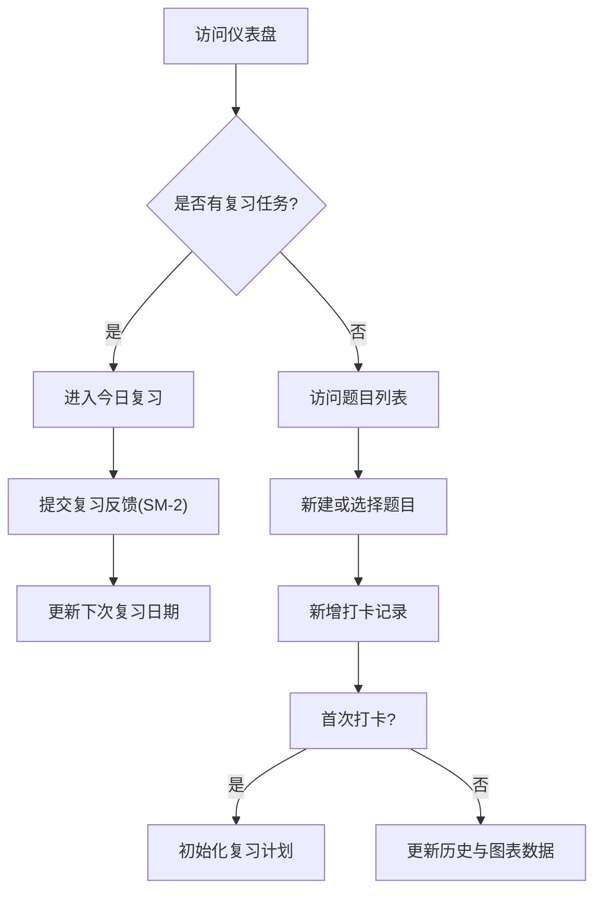

## 1. 产品概述
构建一个面向算法学习者的全栈 Web 应用 (fkLeetcode)，支持刷题打卡、笔记记录、艾宾浩斯复习调度和数据可视化。应用采用浅色现代风格，专业且克制，主要为了帮助学习者高效记录刷题进度，合理安排复习计划，直观展示学习数据。

## 2. 核心功能

### 2.1 角色定义
暂不区分多用户角色，主要面向单人使用场景，无须复杂的登录注册机制（或可根据后续需求补充）。

### 2.2 功能模块
1. **仪表盘 (Dashboard)**: 指标统计、打卡热力图、最近记录、复习队列、图表展示。
2. **题目列表**: 搜索、过滤、分页、新建题目入口。
3. **题目详情**: 题目基本信息、打卡历史、最近笔记。
4. **打卡记录**: Markdown 笔记编辑器、耗时记录、状态标记、自我评分。
5. **今日复习**: 基于 SM-2 算法的复习卡片轮询展示及状态反馈。
6. **数据分析**: 详细的做题数量、难度、标签、耗时等多维度统计图表。

### 2.3 页面详情
| 页面名称 | 模块名称 | 功能描述 |
|-----------|-------------|---------------------|
| 仪表盘 | 概览模块 | 显示已完成题数、通过率、连续打卡天数，以及年度打卡热力图 |
| 仪表盘 | 复习队列 | 展示今日待复习题目，并提供快捷反馈按钮 |
| 题目列表 | 列表与筛选 | 支持按难度、标签搜索和过滤题目，支持新建题目 |
| 题目详情 | 信息与历史 | 展示题目信息，列出历次打卡耗时、状态及最佳笔记 |
| 打卡记录 | 表单与编辑器 | 记录打卡耗时、提交状态，使用支持高亮与预览的 Markdown 编辑器记录笔记，并进行掌握度评分 |
| 今日复习 | 沉浸式复习卡片 | 逐题展示待复习题目及上次笔记，提供“忘记”、“模糊”、“掌握”三个评判按钮以触发算法计算 |
| 数据分析 | 统计图表 | 提供多维度的折线图、雷达图、散点图及标签分布列表 |

## 3. 核心流程
用户主要流程包括：新建/选择题目 -> 打卡并记录笔记 -> 算法生成复习计划 -> 每日进入复习队列进行复习。

## 4. UI 界面设计
### 4.1 设计风格
- **主色与辅色**: 浅色背景 (`#F8F7F4`)，表面白色 (`#FFFFFF`)。主色调为绿色系 (`#3B6D11`)，强调专业与自然；复习色系为紫色 (`#534AB7`)。
- **难度标签**: Easy (`#639922`)、Medium (`#BA7517`)、Hard (`#A32D2D`)。
- **按钮风格**: 圆角 (`--radius-md`)，扁平化现代设计，实色主按钮，描边次按钮。
- **字体与大小**: DM Sans (主体), DM Mono (代码块)，保证数据和代码阅读体验。
- **布局风格**: 卡片式布局，带微弱边框，不使用阴影以保持克制，左侧侧边栏导航，右侧内容区。

### 4.2 页面设计概览
| 页面名称 | 模块名称 | UI 元素 |
|-----------|-------------|-------------|
| 仪表盘 | 侧边栏与导航 | 浅色底，绿色 Logo，当前项高亮，红色数字徽章提示复习数 |
| 仪表盘 | 统计卡片与热力图 | 白色卡片，1px 边框，热力图采用 5 档绿色渐变表示密集度 |
| 题目列表 | 数据表格 | 极简表头，斑马纹或悬停高亮，难度采用胶囊标签 |
| 打卡记录 | 编辑器分栏 | 左右对半分栏，左侧纯文本编辑，右侧实时渲染带语法高亮的 Markdown |
| 今日复习 | 翻页卡片 | 居中大卡片，大号操作按钮，底部显示进度条 |

### 4.3 响应式设计
优先适配桌面端 (Desktop-first)，考虑大屏数据展示。在较小屏幕上（如平板），图表及分栏需支持自适应堆叠 (响应式调整 Grid/Flex)。
