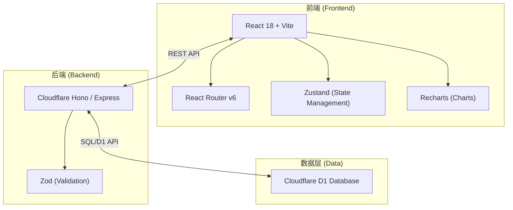
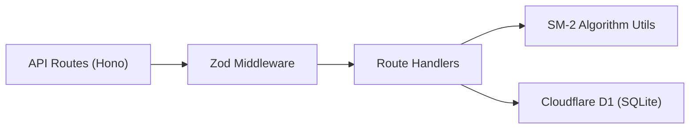
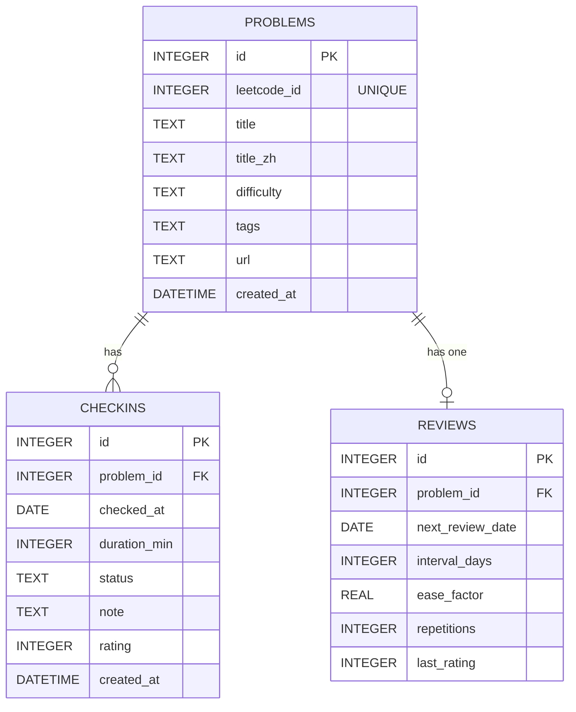

## 1. 架构设计

*(注：为更好地适配 Cloudflare 部署并保持 Express 风格，后端将使用 Hono，它是 Cloudflare 生态下完美替代 Express 的框架，同时全面支持 D1 数据库，并在本地开发时提供良好的体验。)*

## 2. 技术说明
- **前端**: React 18 + Vite + TypeScript + Tailwind CSS
- **状态管理**: Zustand
- **路由**: React Router v6
- **Markdown 渲染**: react-markdown + remark-gfm + rehype-highlight
- **图表与时间**: recharts, date-fns
- **后端**: Hono (完全兼容 Cloudflare Workers 和 D1，具备类 Express 路由设计) + TypeScript
- **数据库**: Cloudflare D1 (SQLite)

## 3. 路由定义 (前端)
| 路由 | 目的 |
|-------|---------|
| `/` | Dashboard 仪表盘（默认页） |
| `/problems` | 题目列表 |
| `/problems/new` | 新增题目表单 |
| `/problems/:id` | 题目详情与打卡历史 |
| `/problems/:id/checkin` | 新增打卡记录（Markdown 编辑器） |
| `/review` | 今日复习（沉浸式卡片） |
| `/stats` | 数据分析与图表 |

## 4. API 定义
| 方法 | 路径 | 描述 |
|------|------|------|
| GET | `/api/problems` | 获取题目列表（支持难度、标签、搜索过滤） |
| POST | `/api/problems` | 新增题目 |
| GET | `/api/problems/:id` | 获取题目详情（包含所有打卡记录） |
| PUT | `/api/problems/:id` | 编辑题目 |
| DELETE | `/api/problems/:id` | 删除题目 |
| GET | `/api/checkins` | 获取打卡记录 |
| POST | `/api/checkins` | 创建打卡记录，并触发/更新复习计划 |
| PUT | `/api/checkins/:id` | 更新打卡记录 |
| DELETE | `/api/checkins/:id` | 删除打卡记录 |
| GET | `/api/reviews/today` | 获取今日到期复习列表 |
| POST | `/api/reviews/:id/respond` | 提交复习反馈 (SM-2)，计算下次复习时间 |
| GET | `/api/stats/overview` | 总览统计数据 |
| GET | `/api/stats/heatmap` | 获取打卡热力图数据 |
| GET | `/api/stats/tags` | 获取各标签统计数据 |
| GET | `/api/stats/weekly` | 近 7 天打卡趋势数据 |

## 5. 服务端架构图


## 6. 数据模型
### 6.1 数据模型定义


### 6.2 DDL 语句 (SQLite / Cloudflare D1)
```sql
CREATE TABLE IF NOT EXISTS problems (
  id INTEGER PRIMARY KEY AUTOINCREMENT,
  leetcode_id INTEGER UNIQUE,
  title TEXT NOT NULL,
  title_zh TEXT,
  difficulty TEXT CHECK(difficulty IN ('Easy','Medium','Hard')) NOT NULL,
  tags TEXT,
  url TEXT,
  created_at DATETIME DEFAULT CURRENT_TIMESTAMP
);

CREATE TABLE IF NOT EXISTS checkins (
  id INTEGER PRIMARY KEY AUTOINCREMENT,
  problem_id INTEGER REFERENCES problems(id) ON DELETE CASCADE,
  checked_at DATE NOT NULL,
  duration_min INTEGER,
  status TEXT CHECK(status IN ('Accepted','WrongAnswer','TimeLimitExceeded')) DEFAULT 'Accepted',
  note TEXT,
  rating INTEGER CHECK(rating IN (1,2,3)),
  created_at DATETIME DEFAULT CURRENT_TIMESTAMP
);

CREATE TABLE IF NOT EXISTS reviews (
  id INTEGER PRIMARY KEY AUTOINCREMENT,
  problem_id INTEGER REFERENCES problems(id) ON DELETE CASCADE,
  next_review_date DATE NOT NULL,
  interval_days INTEGER DEFAULT 1,
  ease_factor REAL DEFAULT 2.5,
  repetitions INTEGER DEFAULT 0,
  last_rating INTEGER
);
```